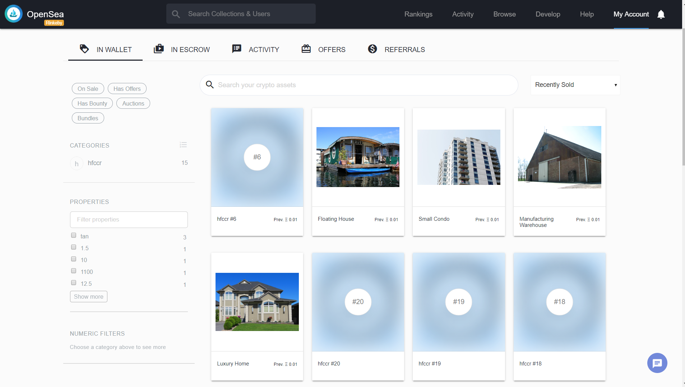

# Blockchain Real Estate

A zero knowledge proof based real estate title token generator.

## Global CLI Requirements

Truffle v5.0.19 - a development framework for Ethereum

Ganache CLI v6.4.3 (ganache-core: 2.5.5)

Docker (for generating new zokrates verifiers)

## Local dependencies
Use `npm install` to install local dependencies.

## Compile Contracts

`cd` into /eth-contracts and use `truffle compile` to compile contracts.

## Generate Verifier

To generate a new zokrates verifier, create a .code file and use `zokrates/zokrates` docker image to generate a verifier.

## Test Contracts

`cd` into /eth-contracts and use `truffle test` to test contracts.

## Migrate Contracts

`cd` into /eth-contracts and use `truffle migrate` to migrate contracts to localhost. Use `truffle migrate --network rinkeby` to deploy to rinkeby. This deploys 'Verifier.sol' and uses the deployment addresss to deploy 'SolnSquareVerifier.sol'. You will need to add a keys.json file in /eth-contracts with the format specified in keys.sample.json to configure your Infura project id and you mnemonic.

## Token Details

Name: HFCCR, Symbol: HFC

## Current Rinkeby Deployment

### Contract Deployment Details

|Contract          |Address           |Transaction Hash|
|------------------|------------------|------------|
|Migrations.sol    |0x4983CCbA847CC9726581615742999941FF36EA52|0x912f6d66321e9110f2c1e74865f2eb2f804655d8d186492b20d08b4bbc36a258|
|Verifier.sol      |0x928800489B3865cd75b9B319Aa18A9D21C75D4e3|0xe2e72862e27e07013b3a121942aff12272570bb2b88130b8f2c61115cc81da65|
|SolnSquareVerifier.sol| 0x5C4b5cf9D60253307039969907ba1f3FCCaC5994|0x59449e40fa4713e61c3e785685d50eff6b982d052f96c8d6b5c600345cb35f55|

[SolnSquareVerifier Rinkeby Etherscan Link](https://rinkeby.etherscan.io/address/0x5c4b5cf9d60253307039969907ba1f3fccac5994)

### Initial Token Generation

|Token ID     | Address|
|-------------|--------|
|2            |0x42b2a...734c6|
|3            |0xe6369...b8d3b|
|4            |0x7f82a...613ba|
|5            |0xe0684...71d8c|
|6            |0x717e9...3d748|
|7            |0xa7b67...bf98a|
|8            |0xe916f...0d4cd|
|9            |0x1a879...e810d|
|10            |0x28caf...e700d|
|11, 12, 13, 14, 15, 16, 17, 18, 19, 20| 0x35124...7ee9e|

### Open Sea Token Sales

|Token ID        | Recipient Address  | Open Sea Link|
|----------------|--------------------|--------------|
|2               | 0x35124...7ee9e    | [Token 2](https://rinkeby.opensea.io/assets/0x5c4b5cf9d60253307039969907ba1f3fccac5994/2)  |
|3               | 0x35124...7ee9e    | [Token 3](https://rinkeby.opensea.io/assets/0x5c4b5cf9d60253307039969907ba1f3fccac5994/3)|
|4               | 0x35124...7ee9e    | [Token 4](https://rinkeby.opensea.io/assets/0x5c4b5cf9d60253307039969907ba1f3fccac5994/4)|
|5               | 0x35124...7ee9e    | [Token 5](https://rinkeby.opensea.io/assets/0x5c4b5cf9d60253307039969907ba1f3fccac5994/5)|
|6               | 0x35124...7ee9e    | [Token 6](https://rinkeby.opensea.io/assets/0x5c4b5cf9d60253307039969907ba1f3fccac5994/6?)|

### Open Sea Screenshot for 0x35124...7ee9e

### Jobs

Looking for awesome blockchain jobs. Email me on hfccr@outlook.com.

# Project Resources

* [Remix - Solidity IDE](https://remix.ethereum.org/)
* [Visual Studio Code](https://code.visualstudio.com/)
* [Truffle Framework](https://truffleframework.com/)
* [Ganache - One Click Blockchain](https://truffleframework.com/ganache)
* [Open Zeppelin ](https://openzeppelin.org/)
* [Interactive zero knowledge 3-colorability demonstration](http://web.mit.edu/~ezyang/Public/graph/svg.html)
* [Docker](https://docs.docker.com/install/)
* [ZoKrates](https://github.com/Zokrates/ZoKrates)
